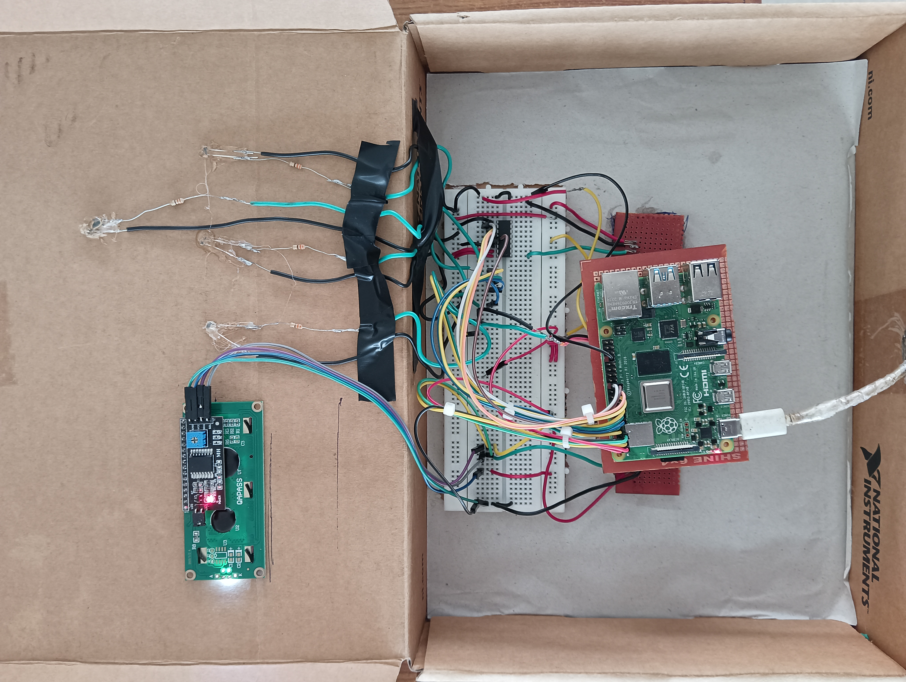
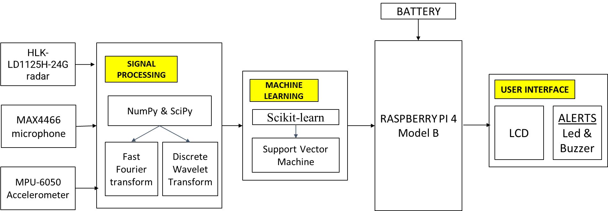

# Advanced Human Life Detection System

An intelligent embedded system designed for detecting human presence in disaster environments using sensor fusion, signal processing, and AI-assisted classification.

This project combines multiple sensing technologies including Ground Penetrating Radar (GPR), Ultra-Wideband (UWB), vibration detection, thermal sensing concepts, and machine learning techniques to improve rescue operations during earthquakes, landslides, and collapsed structure incidents.

---

## Project Overview

The Advanced Human Life Detection System is designed to assist rescue teams in locating trapped or hidden human survivors in difficult environments where direct visual detection is impossible.

The system integrates multiple sensors with embedded processing units to analyze signals and identify possible human presence in real time.

---

## Features

- Human presence detection using multi-sensor fusion
- Embedded signal processing system
- AI-assisted classification concept
- Real-time monitoring and alert system
- Modular and scalable architecture
- Disaster rescue assistance application
- Low-cost prototype approach

---

## System Architecture

The system consists of:

1. Sensor Layer
   - Vibration Sensors
   - UWB / Radar Concepts
   - Thermal Detection Concepts
   - Acoustic Signal Detection

2. Processing Layer
   - Raspberry Pi / Embedded Controller
   - Signal Filtering
   - Data Processing

3. AI Classification Layer
   - Human pattern recognition
   - Signal analysis

4. Output Layer
   - LCD Display
   - Alert System
   - Monitoring Interface

---

## Hardware Components

- Raspberry Pi
- Arduino
- Vibration Sensor
- Acoustic Sensor
- LEDs and Buzzer
- LCD Display Module
- Power Supply Unit
- Communication Modules

---

## Software & Technologies Used

### Programming
- Python
- Embedded C

### Tools & Platforms
- Raspberry Pi OS
- Arduino IDE
- Git & GitHub

### Concepts
- Signal Processing
- Sensor Fusion
- IoT Systems
- Embedded Systems
- AI/ML Fundamentals

---

## Project Structure

```bash
Advanced-Human-Life-Detection/
│
├── config/
├── ml/
├── processing/
├── sensors/
├── ui/
├── utils/
├── assets/
├── main.py
├── requirements.txt
├── project-report.pdf
└── README.md
```

---

## Prototype Images

### System Prototype


### Block Diagram


---

## Installation

Clone the repository:

```bash
git clone https://github.com/vijay-saravanan/Advanced-Human-Life-Detection.git
cd Advanced-Human-Life-Detection
```

---

## Results

- Successfully demonstrated sensor-based detection concepts
- Real-time monitoring functionality implemented
- Embedded processing workflow tested
- Multi-sensor integration architecture developed

---

## Future Improvements

- Thermal camera integration
- GPS rescue tracking
- LoRa communication support
- Cloud monitoring dashboard
- Deep learning-based classification
- Improved radar-based detection

---

## Applications

- Disaster rescue operations
- Earthquake survivor detection
- Industrial safety systems
- Smart surveillance systems
- Military and emergency response applications

---

## Author

### Vijayaragavan Saravanan

Embedded Systems | IoT | Sensor Systems | AI-Assisted Detection Technologies

- GitHub: https://github.com/vijay-saravanan
- Portfolio: https://vijay-saravanan.github.io/

---

## License

This project is for educational and research purposes.
